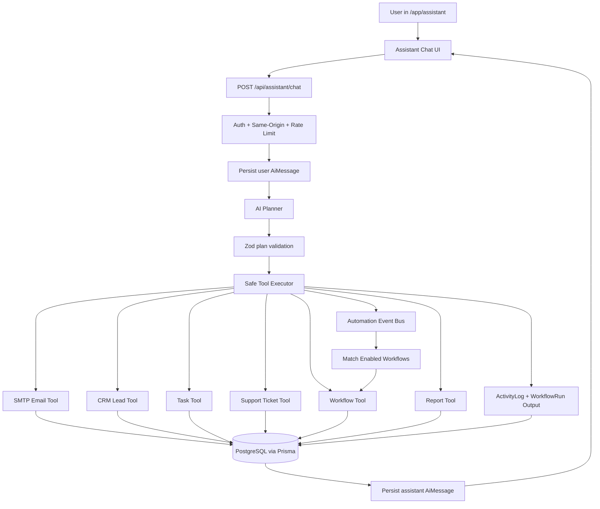
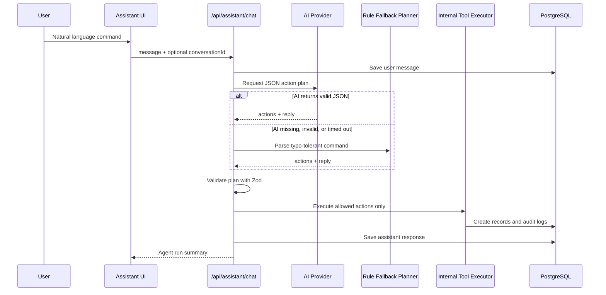
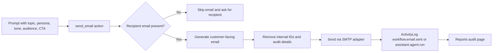
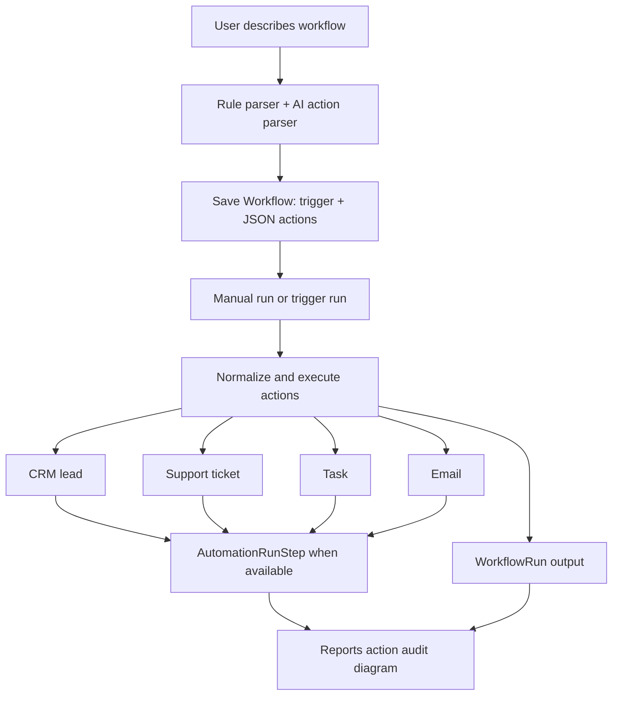
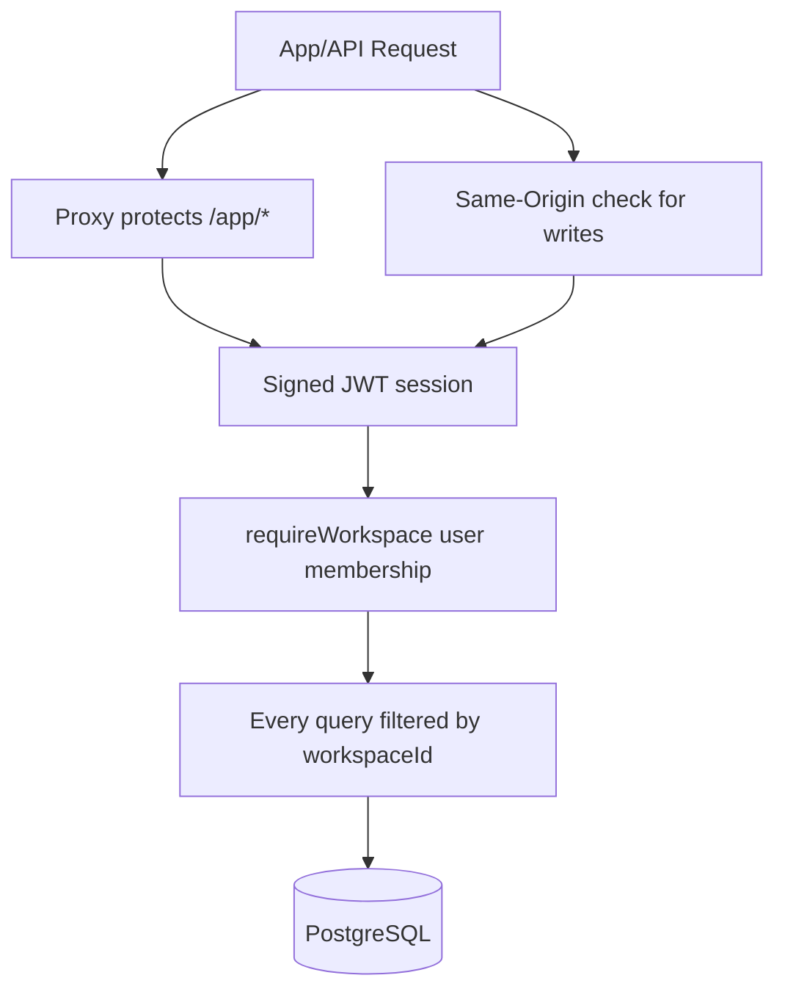

# OpsPilot AI Agent System

This document explains how OpsPilot's AI agent, automations, email, CRM, tasks, support, workflows, reports, and audit trail work together.

## Core Idea

OpsPilot is not only a chatbot. The assistant uses AI as a planner, then executes validated internal tools that are scoped to the signed-in workspace.

OpsPilot also includes a lightweight event-driven automation layer. Product actions emit internal events, and enabled workflows can run automatically from those events.

The agent can:

- Generate customer-facing emails from natural language.
- Send email through the SMTP adapter.
- Create CRM leads from real customer emails.
- Create follow-up tasks.
- Create support tickets.
- Create reusable workflows.
- Run workflow automations.
- Generate daily or weekly reports.
- Write audit logs so users can verify what happened.
- Emit events such as `lead.created`, `ticket.created`, `customer.reply.received`, `task.created`, `report.generated`, and `customer.email.sent`.

## Slash Commands

The assistant accepts normal natural language and these slash command patterns:

- `/email`: write and send a customer email.
- `/workflow`: create a reusable workflow from a trigger and actions.
- `/agent`: run a multi-tool operation from one command.

Recommended command format:

```text
/agent as [persona] write a [tone] email for [audience] about [topic],
send to [customer email],
ask them to [CTA],
create CRM lead, task, support ticket, and report
```

Example:

```text
/agent as founder write a friendly email for SaaS owners about OpsPilot automating CRM and support,
send to buyer@example.com,
ask them to book a demo,
create CRM lead, follow-up task, support ticket, and weekly report
```

## High-Level Architecture



## Event-Driven Automation Layer

```mermaid
flowchart TD
  ProductAction[CRM, Support, Task, Report, or Email action] --> Emit[emitAutomationEvent]
  Emit --> Activity[ActivityLog event.* record]
  Emit --> Route{Event has workflow trigger?}
  Route -- lead.created --> NewLead[NEW_LEAD workflows]
  Route -- ticket.created / customer.reply.received --> NewTicket[NEW_SUPPORT_TICKET workflows]
  Route -- task/report/email --> AuditOnly[Audit only]
  NewLead --> RunWorkflow[Run matching enabled workflows]
  NewTicket --> RunWorkflow
  RunWorkflow --> Reuse[Reuse triggering lead or ticket]
  Reuse --> Suppress[Suppress child events to avoid loops]
  Suppress --> RunOutput[WorkflowRun output + steps]
  RunOutput --> Reports[/app/reports audit diagram]
```

Events currently supported:

| Event | Triggered From | Workflow Trigger |
| --- | --- | --- |
| `lead.created` | CRM lead creation | `NEW_LEAD` |
| `ticket.created` | Support ticket creation | `NEW_SUPPORT_TICKET` |
| `customer.reply.received` | Support reply handling | `NEW_SUPPORT_TICKET` |
| `task.created` | Task creation | Audit only |
| `report.generated` | Report generation | Audit only |
| `customer.email.sent` | Assistant/workflow email send | Audit only |

Workflow-created child records use `suppressEvents` so a workflow does not recursively trigger itself.

## AI Planning Flow



## Safe Tool Actions

The assistant does not execute arbitrary code. It can only request these typed actions:

| Action | Internal Result | Guardrail |
| --- | --- | --- |
| `send_email` | Generates customer-facing email and sends SMTP mail | Requires real recipient email |
| `create_lead` | Creates CRM lead/contact/company context | Requires real lead email |
| `create_task` | Creates follow-up task | Workspace scoped |
| `create_ticket` | Creates support ticket and AI draft context | Requires real customer email |
| `create_workflow` | Saves workflow definition | Validated trigger/actions |
| `create_report` | Generates operations report | Uses real database metrics |

## Email Automation Flow



Customer-facing email content is generated separately from internal records. The customer should not see internal workflow actions, task IDs, ticket IDs, database updates, or audit logs.

## CRM, Task, Support, Report Flow

```mermaid
flowchart TD
  Command[One natural-language command] --> Extract[Extract email, name, company, persona, tone, topic]
  Extract --> Lead{CRM requested?}
  Extract --> Task{Task requested?}
  Extract --> Ticket{Support requested?}
  Extract --> Report{Report requested?}

  Lead -- Yes --> CreateLead[Create Lead + score + summary + next action]
  Task -- Yes --> CreateTask[Create follow-up Task]
  Ticket -- Yes --> CreateTicket[Create Ticket + category + escalation + draft]
  Report -- Yes --> CreateReport[Create daily/weekly Report]

  CreateLead --> Audit[ActivityLog]
  CreateTask --> Audit
  CreateTicket --> Audit
  CreateReport --> Audit
  Audit --> ReportsPage[/app/reports audit feed]
```

## Workflow Automation Flow



If the `AutomationRunStep` delegate is unavailable in a stale dev Prisma client, `/app/reports` falls back to the saved `WorkflowRun.output.steps` so the page still shows action status instead of crashing.

## Reports And Audit Trail

Reports combine:

- `ActivityLog` events.
- `WorkflowRun` status and output.
- `AutomationRunStep` status when available.
- Real counts from tasks, leads, contacts, tickets, workflows, and emails sent.

```mermaid
flowchart LR
  DB[(Workspace Database)] --> Metrics[Build Workspace Metrics]
  Activity[ActivityLog] --> Metrics
  Runs[WorkflowRun] --> Metrics
  Steps[AutomationRunStep or Run Output Steps] --> Metrics
  Metrics --> Report[Generated Report]
  Metrics --> AuditDiagram[/app/reports Action Audit Diagram]
```

## Authentication And Workspace Safety



Key safety controls:

- `/app/*` is protected by the app proxy.
- API writes use same-origin checks.
- Assistant requests are rate limited.
- Request bodies are validated with Zod.
- Queries are scoped by `workspaceId`.
- Assistant tools refuse missing customer emails for email/CRM/support actions.
- Dangerous actions like arbitrary deletion are not exposed to the AI planner.

## Main Files

| Area | Files |
| --- | --- |
| Assistant UI | `app/app/assistant/page.tsx`, `components/app/assistant-chat.tsx`, `components/app/assistant-guide-card.tsx` |
| Assistant API | `app/api/assistant/chat/route.ts` |
| AI provider and prompts | `lib/ai.ts` |
| Plan schema and fallback parser | `lib/ops/assistant-planning.ts` |
| Tool execution | `lib/ops/assistant-agent.ts` |
| Workflows | `lib/ops/workflows.ts`, `app/api/workflows/*` |
| CRM | `lib/ops/lead.ts`, `app/api/crm/*` |
| Tasks | `lib/ops/tasks.ts`, `app/api/tasks/*` |
| Support | `lib/ops/support.ts`, `app/api/support/*` |
| Reports | `lib/ops/reports.ts`, `app/app/reports/page.tsx` |
| Auth and API safety | `lib/auth.ts`, `lib/auth-jwt.ts`, `lib/api.ts`, `proxy.ts` |

## Hackathon Demo Path

1. Open `/app/assistant`.
2. Click `New chat`.
3. Use the `/agent` prompt recipe.
4. Replace `customer@example.com` with a real email.
5. Send the command.
6. Verify:
   - `/app/crm`: lead created.
   - `/app/tasks`: follow-up task created.
   - `/app/support`: ticket created.
   - `/app/reports`: report and audit diagram updated.
   - Email inbox: customer-facing email delivered when SMTP is configured.

## Current Limits

- SMTP works for outbound email, but production-grade inbound replies should use webhook providers like Resend, Postmark, SendGrid, or Mailgun instead of Gmail IMAP polling.
- External CRM/Slack adapters are structured as future integration points; current hackathon MVP focuses on real internal database actions.
- High-risk future actions should use approval queues before execution.
