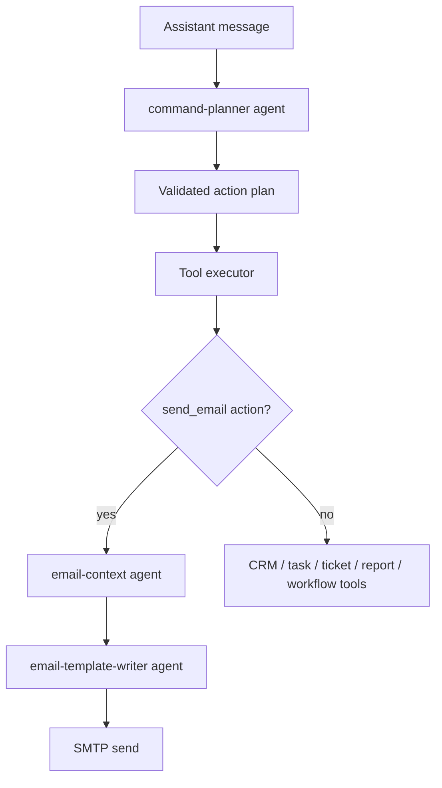

# AI Provider, API Key, and Fallback Behavior

How the OpsPilot agent behaves **with** and **without** an AI API key, and how to switch it on, off, or to a different provider. This complements [AI_AGENT_SYSTEM.md](./AI_AGENT_SYSTEM.md), which covers the agent architecture.

## TL;DR

The assistant has two execution paths:

1. **Token-powered AI agents** (an LLM plans the actions and writes email copy) — runs when `HCNSEC_API_KEY` is set and reachable.
2. **Deterministic fallback planner** (`lib/ops/assistant-planning.ts`) — a typo-tolerant rule parser that creates the same action types without any LLM call.

Which path runs is controlled by two env vars: `HCNSEC_API_KEY` and `AI_AGENT_FALLBACK_ENABLED`.

## Environment variables

| Variable | Required | Default | Purpose |
| --- | --- | --- | --- |
| `HCNSEC_API_KEY` | No | — | API key for the OpenAI-compatible AI provider. When unset, AI agents are disabled and the fallback planner runs. |
| `AI_API_BASE_URL` | No | `https://api.hcnsec.cn/v1` | OpenAI-compatible base URL. Change this to switch providers (Groq, OpenAI, Gemini, OpenRouter, etc.). |
| `AI_MODEL` | No | `DeepSeek-V4-Flash` | Model name passed to the provider. Must be a valid model id for `AI_API_BASE_URL`. |
| `AI_AGENT_FALLBACK_ENABLED` | No | `false` | `true` = use the deterministic planner when the AI call fails, times out, or is unconfigured. `false` = refuse to serve AI-powered features without a working key. |

All four are read through the Zod-validated `env` in `lib/env.ts` — never read them directly from `process.env`.

## The four behavior modes

| `HCNSEC_API_KEY` | `AI_AGENT_FALLBACK_ENABLED` | What happens |
| --- | --- | --- |
| set + reachable | `false` | **Strict AI.** The specialized LLM agents run every request. If a call fails or times out, the assistant returns an "AI agent call failed" task containing the **real error** (so you can diagnose it). |
| set + reachable | `true` | **AI with safety net.** Tries the LLM first; on any failure/timeout, falls back to the deterministic planner. Best for unreliable providers. |
| unset (or unreachable) | `true` | **Deterministic only.** Every request uses the fallback planner. No LLM is called. Works offline. |
| unset (or unreachable) | `false` | **Disabled.** Every assistant request returns a "Configure AI agent key" task and refuses to act. |

The current production deployment runs in **mode 2** (`AI_AGENT_FALLBACK_ENABLED=true`) because the HCNSEC endpoint is unreachable from Vercel's US-East region (see [Known limitation](#known-limitation-hcnsec-timeout-from-vercel)).

## With an API key: the specialized agents

When `HCNSEC_API_KEY` is set and the provider is reachable, the assistant calls five specialized agents (all defined in `lib/agents/opspilot-agents.ts`, all sharing the one key against `AI_API_BASE_URL` / `AI_MODEL` via `@ai-sdk/openai-compatible`):

| Agent | Role |
| --- | --- |
| command-planner | Converts a natural-language command into a validated JSON action plan. |
| email-context | Reads a rough email request and produces a structured brief (recipient, subject intent, body context, tone, persona, audience, CTA, missing fields). |
| email-template-writer | Turns the brief into a clean customer-facing email (subject, preview, greeting, body, signoff). |
| workflow-architect | Converts a workflow description into a list of safe action steps. |
| support-reply-writer | Drafts concise support replies. |

Flow:



Structured output is produced by `generateStructuredJson`, which extracts the first `{...}` block from the model response and re-prompts once on parse failure — it does **not** rely on provider-native JSON mode, so it works with any OpenAI-compatible endpoint.

Email copy is separated from internal records: customer-facing bodies never contain task IDs, ticket IDs, workflow actions, or audit details.

## Without an API key: the deterministic fallback

When the key is unset, unreachable, or the call fails with fallback enabled, the assistant uses `fallbackAssistantPlan(message)` in `lib/ops/assistant-planning.ts`. This is a hand-written, typo-tolerant rule parser that:

- Extracts real emails (`meil`, `emsil`, `e-mail`, `mail`, `send to` → `send_email`).
- Detects intent for CRM, task, ticket, report, workflow, and marketing from keywords and common misspellings (`taks`, `tiker`, `wrkflow`, `repot`, `makeketing`, `allpaegs`).
- Infers `persona`, `tone`, `audience`, `callToAction`, `name`, `company` from phrase patterns.
- Produces the **same** action plan shape as the AI planner, so the tool executor runs unchanged.
- Generates a plain-text email body via `fallbackEmail()` in `lib/ai.ts` (template-based, no LLM).

What the fallback **can** do: create leads/tasks/tickets/reports/workflows, send email, handle slash commands, broad typo tolerance.

What the fallback **cannot** do: nuanced natural-language reasoning, rich personalized email prose, ambiguous multi-step commands. For those, a reachable LLM is required.

## How to check the provider

```bash
npm run ai:check   # scripts/check-ai-provider.ts
```

This loads `.env.local`, calls the provider with a one-token prompt, and prints `ok` + the model/output or the failure reason. It is the fastest way to verify the key, base URL, and model name are valid before deploying.

## Switching providers (no code change)

The provider is fully controlled by three env vars. To switch from HCNSEC to a Vercel-reachable provider, set on Vercel (and in `.env.local` / `.env.production`):

| Provider | `AI_API_BASE_URL` | `AI_MODEL` | Key env |
| --- | --- | --- | --- |
| Groq (fast, free tier) | `https://api.groq.com/openai/v1` | `llama-3.3-70b-versatile` | `HCNSEC_API_KEY=gsk_...` |
| OpenAI | `https://api.openai.com/v1` | `gpt-4o-mini` | `HCNSEC_API_KEY=sk-...` |
| Google Gemini | `https://generativelanguage.googleapis.com/v1beta/openai/` | `gemini-1.5-flash` | `HCNSEC_API_KEY=...` |
| OpenRouter (300+ models) | `https://openrouter.ai/api/v1` | `anthropic/claude-3.5-sonnet` | `HCNSEC_API_KEY=sk-or-...` |

The env var is named `HCNSEC_API_KEY` for historical reasons but holds the key for whichever provider `AI_API_BASE_URL` points at. After changing these on Vercel, redeploy so serverless functions pick up the new values, then run `npm run ai:check` locally with the same values to confirm.

## Known limitation: HCNSEC timeout from Vercel

The default provider endpoint `api.hcnsec.cn` is hosted in China. From Vercel's default US-East (`iad1`) region the connection stalls and the 20-second timeout in `withTimeout()` (see `lib/ai.ts`) fires on most requests. Locally (or from a China/Asia-reachable network) the same key works fine — `npm run ai:check` returns `ok`.

Until the provider is switched or the deployment region changes, production runs in **fallback mode** and the deterministic planner handles assistant requests. To restore real LLM behavior in prod, switch to a globally reachable provider using the table above.

## Files

| Area | File |
| --- | --- |
| AI provider + prompts + fallback gating | `lib/agents/opspilot-agents.ts` |
| Assistant request flow + fallback dispatch | `lib/ai.ts` |
| Deterministic fallback planner + email | `lib/ops/assistant-planning.ts`, `lib/ai.ts` (`fallbackEmail`) |
| Tool executor (shared by both paths) | `lib/ops/assistant-agent.ts` |
| Env schema | `lib/env.ts` |
| Provider connectivity check | `scripts/check-ai-provider.ts` |
| Agent registry | `lib/agents/agent-team.ts` |
